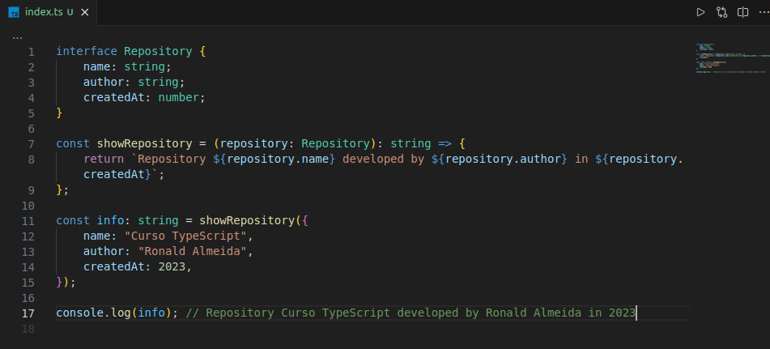

<h1 align="center">
    TypeScript do básico ao avançado
</h1>

  <a href="#-curso">Curso</a>&nbsp;&nbsp;&nbsp;|&nbsp;&nbsp;&nbsp;
  <a href="#-aulas">Aulas</a>&nbsp;&nbsp;&nbsp;|&nbsp;&nbsp;&nbsp;
  <a href="#-projetos">Projetos</a>&nbsp;&nbsp;&nbsp;|&nbsp;&nbsp;&nbsp;
  <a href="#-licença">Licença</a>&nbsp;&nbsp;&nbsp;|&nbsp;&nbsp;&nbsp;
  <a href="#-contate-me">Contate-me</a>

 

  

## 📚 Curso

Curso Udemy de <strong>TypeScript</strong> do básico ao avançado. 
TypeScript - um superset do JavaScript com tipagem estática (front-end e back-end).

## ✍🏾 Aulas

-   [Tipos TS básicos]("./src/section19-basicTypes")
-   [Tipos TS Avançados]("./src/section21-advancedTypes")
-   [Tipos TS Genéricos]("./src/section22-genericTypes")
-   [SOLID]("./src/section25-SOLID")
-   [POO]("./src/section20-POO")
-   [JEST]("./src/section26-Jest")
-   [NamespacesAndModules]("./src/section24-Namespaces")
-   [Decorators]("./src/section23-Decorators")

## ✍🏾 Projetos

-   [Pomodoro]("./projects/pomodoro")
-   [Video Controls]("./projects/video")
-   [Form Validation]("./projects/form")

## 📬 Contate-me

  
    &nbsp;
  

## 📝 Licença

Lançado em 2023, 📝 [Licença MIT](./LICENSE)

---

Plataforma de estudos Udemy - [Curso de TypeScript do básico ao avançado](https://www.udemy.com/course/curso-de-javascript-moderno-do-basico-ao-avancado/)🚀
